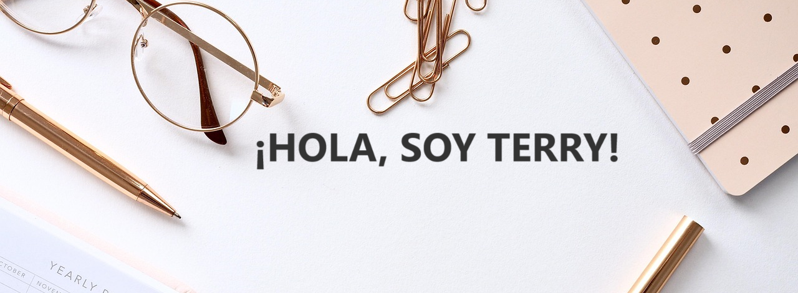

<h2>Soy un apasionado desarrollador frontend. Me encanta programar y desarrollar nuevas tecnologías.</h2>

 
><h3>Tecnologías, herramientas y lenguajes que uso</h3>

  
  
  
  
  
  
  
  
  
  
  
  
  
  
  
  
  
  
   
  
  
  
  

><h3>Sígueme en mis redes sociales</h3>

  
  
  
  
  

<h4 align="center">Trabajemos juntos</h4>

  
  
  

